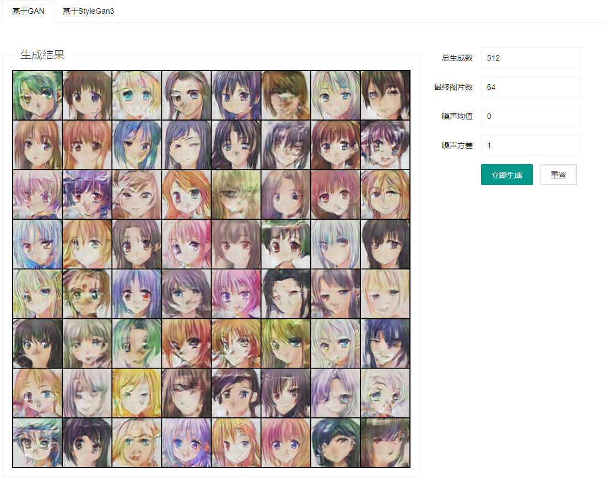
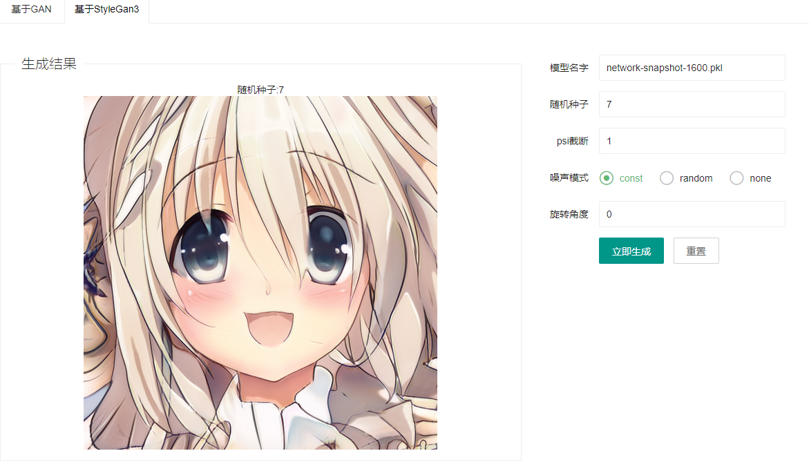
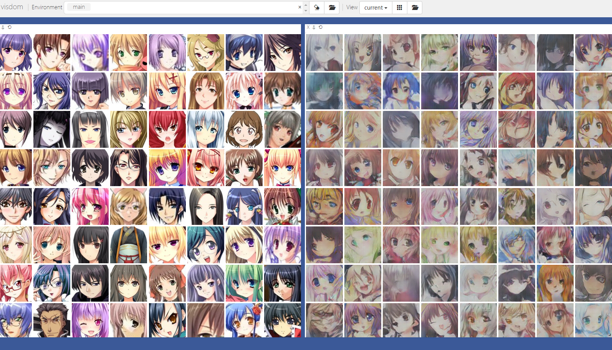

# 动漫头像生成项目
> 欢迎关注B站：https://space.bilibili.com/343147393

## 视频介绍
B站：https://www.bilibili.com/video/BV1MF411G7UU

## 效果展示
### 基于GAN

### 基于StyleGan3

## 模型训练

### 数据集下载
小批量数据（6w张，411MB）：https://github.com/bchao1/Anime-Face-Dataset

大批量数据（14W张，10.9G）：https://www.kaggle.com/datasets/lukexng/animefaces-512x512

### 基于gan模型的训练
原项目地址： https://github.com/chenyuntc/pytorch-book/tree/master/chapter07-AnimeGAN

数据集地址：https://github.com/bchao1/Anime-Face-Dataset

首先下载数据集，然后把所有的图片放到`data/faces`目录下。

#### 训练模型

模型的一些参数都可以在train_gan.py里面进行配置

```bash
python train_gan.py
```
> 注意：数据集里面其实有很多错误的图片，我们可以自己使用下面这个脚本自动删除错误的图片
```python
import os
from PIL import Image

if __name__ == '__main__':
    # 读取所有的文件
    for file in os.listdir("data/faces"):
        filename = "data/faces/%s" % file
        try:
            Image.open(filename)
        except:
            os.remove(filename)
            print("%s错误" % filename)
```

#### 数据可视化
```bash
# 使用visdom启动一个服务，默认监听8097端口
visdom
```
修改训练代码的`train_gan.py`的`vis = True`然后训练的时候就可以看到实时的训练结果了



训练好的模型都会存到`model/gan`目录下

### 基于style-gan3的训练
原项目地址： https://github.com/NVlabs/stylegan3

数据集地址：https://www.kaggle.com/datasets/lukexng/animefaces-512x512

#### 数据转换
默认stylegan3不支持我们前面的那个数据集，需要进行数据转换，转换代码如下
```bash
python arithmetic/stylegan3/dataset_tool.py --source=data/anime_face --dest=data/animation.zip
```

#### 开始训练
如果GPU显存不够大话可以把batch改小一点，我的是3060，这里改成了8
- outdir 表示模型的输出路径
- cfg 表示配置信息，可以选择stylegan3-t、stylegan3-r、stylegan2，我们默认选第一个就可以了
- data 表示数据集地址，这里需要使用前面转换后的内容
- gpus 表示GPU个数，我们就一个GPU，所以选1
- batch 表示一次取多少条数据，如果显存不够大的话可以改小一点
- gamma 表示正规化权重，保持默认
- mirror 数据集X轴翻转
详细配置说明参考：https://github.com/NVlabs/stylegan3/blob/main/docs/configs.md
```bash
python train_style.py --outdir=data/out --cfg=stylegan3-t --data=data/animation.zip --gpus=1 --batch=8 --gamma=8.2 --mirror=1
```

## 项目运行

自己把训练好的模型放到model目录下，像下面这样
```bash
.
├── gan
│   ├── netd.pth
│   ├── netg.pth
└── stylegan3
    ├── network-snapshot-1600.pkl
```

# 安装依赖

```bash
pip install -r requirements.txt
python main.py
```
